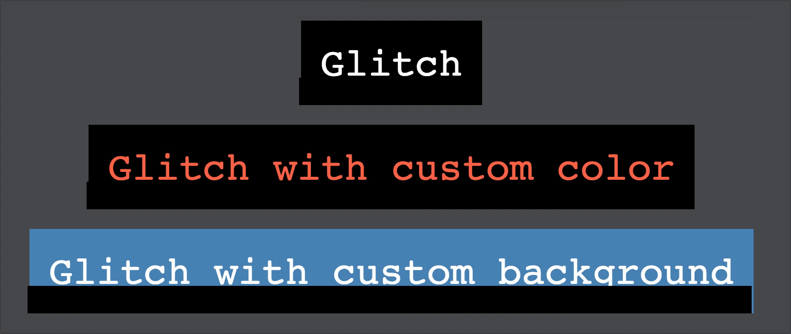

# vue-glitch

> 👻 Vue.js component to apply glitch effect in any kind of text

[ ](https://app.codeship.com/projects/214292)
[](https://coveralls.io/github/ianaya89/vue-glitch)




## Install

```bash
$ npm i -S vue-glitch

# or

$ yarn add vue-glitch
```

## Global Registration

```javascript
// main.js

import Vue from 'vue';
import Glitch from 'vue-glitch';

Vue.component('glitch', Glitch);
```

## Local Registration

```html
<script>
  // Component.vue
  import Glitch from 'vue-glitch';

  export default {
    name: 'Component',

    components: { Glitch }
  };
</script>
```

## Component Usage

```html
<template>
  <main>
    <glitch text="Glitched"></glitch>
    <glitch text="Glitched with custom color", color="tomato"></glitch>
    <glitch text="Glitched with custom background", background="steelblue"></glitch>
  </main>
</template>
```

## Component Properties

| name | required | default |
| :---: | :---: | :---: |
| text | `true` |  |
| color | `false` | `#fff` |
| background | `false` | `#000` |


## Component Styling
> To apply custom styles you should care about `.glitch` and `.glitch-wrapper` classes.

```css
.glitch {
  margin-bottom: 20px;
  padding: 20px;
  font-size: 40px;
}

.glitch-wrapper {
  font-family: sans-serif;
}
```


## Development Setup

```bash
# install dependencies
$ npm i

# dev mode
$ npm run dev

# test
$ npm run test

# build
$ npm run build
```

## License
[MIT License](https://github.com/ianaya89/vue-glitch/blob/master/LICENSE)


## Style
[](http://standardjs.com)


---
*This project was generated with [generator-vue-component](https://github.com/ianaya89/generator-vue-component) and was inspired by [this](https://codepen.io/anatravas/pen/mOyNWR) Codepen by [@anatravas](https://codepen.io/anatravas/)*

**⌨️ with ❤️ by [@ianaya89](https://twitter.com/ianaya89)**
